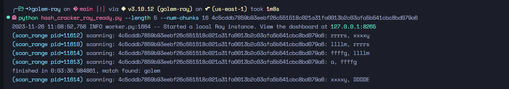
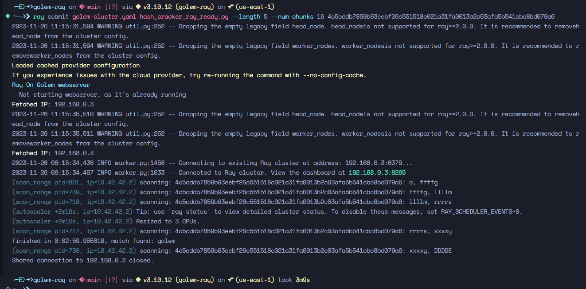

# Ray on Golem Pre-Alpha Preview Program

The task assigned as part of the Ray on Golem Pre-Alpha Preview Program #2 involves parallelizing a given hash cracker script using Ray and executing it on the Ray on Golem cluster. The goal is to evaluate whether Ray on Golem makes it easier to parallelize Python code for processing large datasets or solving complex computational tasks.

### Provided Code

The provided Python script is a hash cracker that takes a sha256 hash of an unknown word as input and searches for a matching word. The script was not initially made to work with Ray or Golem or Ray. The challenge is to parallelize this script to make it run faster.

## Solution Overview

### Understanding Ray on Golem Documentation

Before diving into the code, I thoroughly reviewed the Ray on Golem documentation. The documentation has a good structure.However, one thing I'd like to point out here is that the official Ray documentation focuses mainly on the AI and ML applications of ray. The user has to specifically go to the ray core documentation to get a feel of what this library is doing. I'd suggest there should be a complete tutorial / reference of ray core on the ray_on_golem documentaiton so that newcomers and people unaware of distributed computing don't get bogged down in the unnecessary details. For example if you visit the [Ray Docs](https://docs.ray.io/en/latest/) you're presented with a batch inference script which to me is a bit scary. So **ray_on_golem** documentation should have it's own section of ray core documentation. Presented in a way that is easily understandable to people who are new to distributed computing.
 
### Parallelizing the Hash Cracker Code with Ray

#### Code Modification
I modified the given hash cracker script to utilize Ray for parallel execution. The key focus was on optimizing the code to benefit from distributed execution on the Ray on Golem cluster. For the given task our main hotspot is the `scan_range` function where majority of the processing happens. In my solution I have made it a ray task that executes on the remote cluster. To address the challenge of avoiding the wait for the entire word space to be scanned, I made use of the `ray.wait()` function. This function allowed the script to retrieve individual results as soon as they were ready, enabling early termination when a match was found.

### Executing Locally
Below is a sample run of the same code on the local ray cluster. This is mentioned just for comparison. 
Machine Specs: i5-6500 4 Cores@3.2Ghz, 12GB Memory Running on Ubuntu in WSL2
> Running Locally

### Execution on Ray on Golem Cluster
Sample run of the same code on the Ray on Golem cluster. 

> Running on ray_on_golem

### Engagement with the Ray on Golem Team

I had previous experience with Golem network (being one of the JS/TS SDK tester) however  I actively engaged with the Ray on Golem team on the designated Discord channel (#Ray on Golem). They were very helpful and available to solve issues I encountered.

